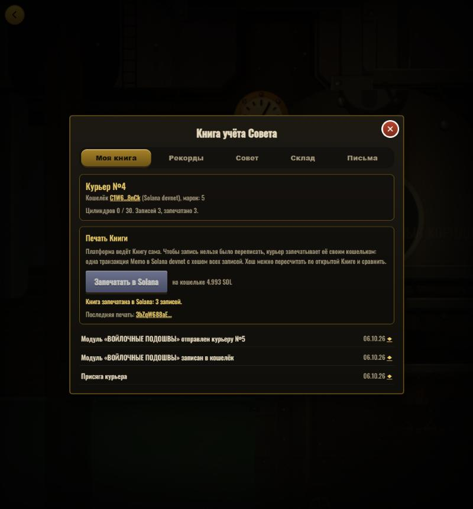

# КЕНОТАФ — Cenotaph

[](https://github.com/kuatovadilzan504-source/kenotaf-colosseum/actions/workflows/ci.yml)
[](https://solana.com)
[](https://developers.metaplex.com/core)
[](https://idosgames.com/app/16KMA60R/)
[](https://colosseum.org)

> A diesel-punk metroidvania where **Solana is the Council's ledger**: your wallet is your courier identity, every deed goes into a
> Book you can seal on-chain, and the modules of your backpack are **Metaplex Core assets** that the game honours only while your
> wallet holds them — and that the pneumatic mail can carry to another player.

[**Play now**](https://16kma60r.idos.games/) · [Judges' guide](docs/JUDGES.md) · [Architecture](docs/ARCHITECTURE.md) · [The game (RU)](docs/GAME.md) · [Platform page](https://idosgames.com/app/16KMA60R/)

---


---

## Submission to the iDos Games × Solana hackathon (Colosseum 2026)

| Name | Role | Contact |
|------|------|---------|
| Kuatov Adilzhan | Solo developer | [GitHub](https://github.com/kuatovadilzan504-source) |

---

## Problem and Solution

### 1. The chain is bolted on, not part of the game
- **Problem:** in most Web3 games the blockchain is a shop or a token menu next to the game; a player who doesn't care about crypto feels nothing.
- **КЕНОТАФ:** the story is about a Council that keeps a ledger of couriers and forbids them to read the letters they carry. Solana *is* that ledger — sign-in is the courier's oath, the seal is the Council's stamp, the mail carries real assets.

### 2. Player progress lives in a database you have to trust
- **Problem:** achievements and records can be rewritten by whoever runs the server.
- **КЕНОТАФ:** the **Book of the Council** (letters read, guardians beaten, records, endings, modules minted and mailed) can be sealed by the player's own wallet with one **Memo** transaction carrying a SHA-256 digest of every entry. [`verify-seal.mjs`](idos/scripts/verify-seal.mjs) recomputes it from the public ledger and compares it with the chain.

### 3. "Owned" items are rows in someone else's table
- **Problem:** in-game items belong to the game's database, not to the player.
- **КЕНОТАФ:** the twelve backpack modules can be written into the wallet as **Metaplex Core assets**. The game reads ownership **from Solana every time** — sell, lose or mail the asset and the module leaves your backpack.

### 4. Single-player games are lonely, and a social layer needs a backend
- **Problem:** letters, trading and shared statistics usually mean servers, moderation and months of work.
- **КЕНОТАФ:** couriers leave letters at the mail stations and mail modules to each other; the whole server side is **iDos Games configuration** (data collections, a `Stamps` currency, leaderboards, word filter, ban levels), generated by one script.

### 5. Onboarding friction
- **Problem:** wallets, fees and gas scare players away before the game starts.
- **КЕНОТАФ:** signing in is a message signature — no transaction, no fee. Guests can play everything except the on-chain actions. The game also runs completely standalone (`game/index.html`).

---

## Why Solana

- **Cost** — the seal is one Memo transaction for a fraction of a cent; a player can seal their Book whenever they like.
- **Cheap, simple assets** — a Metaplex Core asset is a single account (≈ 0.0035 SOL of rent in our tests) with on-chain attributes (`module`, `courier`, `game`); no token accounts, no extra metadata programs.
- **Speed** — a mint or a transfer confirms in seconds, so mailing a module feels like part of the game, not a checkout.
- **Wallets players already have** — Phantom, Solflare and Backpack sign the login challenge, the seal and the transfers directly in the browser.

---

## Summary of Features

- **Wallet sign-in** (signature only) → courier number from a registry whose record key *is* the number, so numbers are never shared
- **The Book of the Council** — every deed recorded per wallet; counters show how many couriers did the same
- **On-chain seal** — one Memo transaction with the digest of the whole Book, independently verifiable
- **Backpack modules as Metaplex Core assets** — mint, hold (the game follows the wallet), transfer
- **Pneumatic mail** — send a module to another courier by number; the recipient accepts it after an on-chain ownership check
- **Letters between couriers** — cost a stamp, reading a stranger's letter pays one back; word filter, moderator role, ban levels
- **Seven leaderboards** (five test stands, the Council exam, letters read) and the **Council** tab: how all couriers ended the game
- **Cloud save** bound to the account
- Underneath: a complete metroidvania — 86 rooms, five zones, ten bosses, thirty recorded letters, two endings

| | | |
|---|---|---|
|  |  |  |
| Pneumatic-mail station | Letter dialog with the moderation warning | The Book: a module written to the wallet and mailed to courier №5, all sealed |

---

## Tech Stack

| Layer | Technology |
|-------|-----------|
| Game | Vanilla JavaScript · Canvas 2D / WebGL · no engine, no build step |
| Host app | React 19 · TypeScript · Vite |
| Platform | iDos Games SDK (`@idosgames/core`, `app-shell`, `module-sdk`, `wallet`) · data collections · leaderboards · currency · bans |
| Solana | `@solana/web3.js` · Memo program · Metaplex Core (`mpl-core` + Umi) · Phantom / Solflare / Backpack |
| Testing | Node scripts against the real backend with throwaway wallets · devnet runs of the seal and the module cycle |

---

## Architecture

```
 ┌──────────────────────────── browser ────────────────────────────┐
 │  host (React, iDos Games SDK)                game (iframe, vanilla JS)
 │  ├ wallet sign-in                            ├ js/core/chain.js  ← the ONLY file that knows the host
 │  ├ module "kenotaf" ◄──── postMessage ─────► │ hooks: letters read, guardians, stands, exam, ending,
 │  │   bridge → Book, leaderboards, letters,   │        mail station, modules found
 │  │   modules (the game follows the wallet)   └ runs alone (file://): every Chain call is a no-op
 │  └ Book / Depot / letter dialogs · seal (Memo) · mint & transfer (Core)
 └───────────────┬───────────────────────────────────┬──────────────┘
                 │ platform API                      │ Solana RPC (mainnet)
        iDos Games Title 16KMA60R            Memo program · Metaplex Core
        data collections · counters          (every transaction signed by
        leaderboards · Stamps · bans          the player's own wallet)
```

See [docs/ARCHITECTURE.md](docs/ARCHITECTURE.md) for the platform configuration, the data model and the repository layout.

---

## Quick Start

**Prerequisites:** Node.js 20+, a desktop browser.

```bash
# The game alone — no build, no server
open game/index.html

# Clone and run the whole thing (host + game) against the test namespace on devnet
git clone https://github.com/kuatovadilzan504-source/kenotaf-colosseum
cd kenotaf-colosseum/idos
npm install
printf 'VITE_KZ_NS=dev_\nVITE_KZ_CHAIN=devnet\n' > .env.local   # a production build sets neither
npm run dev

# Checks
npm run typecheck
node scripts/test-wallet-login.mjs     # Solana sign-in, no browser
node scripts/test-backend.mjs          # ledger, courier registry, assets, parcels, leaderboards, cloud save → ALL OK
KZ_TEST_KEY=<json key> node scripts/test-seal.ts       # Memo seal on devnet, digest read back
KZ_TEST_KEY=<json key> node scripts/test-modules.ts    # Core mint → attributes → transfer → ownership moved (devnet)
node scripts/verify-seal.mjs <courierNo> <signature>   # verify anyone's seal against the public ledger
```

---

## Status

Verified against the real backend: wallet sign-in, the Book and its counters, letters (cost, reward, blocked words), leaderboards, cloud save,
courier registry, asset index and parcels between two accounts. On **devnet** with a funded key: the Memo seal (digest recomputed and matching) and
the module cycle (mint, attributes, transfer, ownership). In a browser the same flows ran with a stand-in wallet object signing with that key —
including a module mailed from one courier to another, disappearing from one backpack and appearing in the other.

**Not verified yet:** a real wallet extension signing on mainnet, and sign-in inside the idosgames.com frame.
**Known limit:** the game is client-side, so the Core assets prove *ownership and transfer*, not that a module was earned in play.

---

## Roadmap

- [x] Complete single-player game (86 rooms, two endings, Council exam)
- [x] Wallet sign-in, courier registry, the Book of the Council
- [x] On-chain seal with independent verification
- [x] Letters between couriers with stamps, word filter and moderation
- [x] Backpack modules as Metaplex Core assets, mailed between couriers
- [ ] End-to-end runs with Phantom, Solflare and Backpack on mainnet
- [ ] Modules minted into a verified collection with a server-checked mint, so a module proves it was earned
- [ ] Other couriers' ghosts at the test stands
- [ ] English localization
- [ ] Mobile wallets via WalletConnect

---

## Resources

- [Live application](https://16kma60r.idos.games/)
- [iDos Games page](https://idosgames.com/app/16KMA60R/)
- [Judges' guide](docs/JUDGES.md) — a 5-minute route and how to check the Solana part yourself
- [The game: controls, settings, structure (RU)](docs/GAME.md)
- [Design document (RU)](docs/DESIGN.md)
