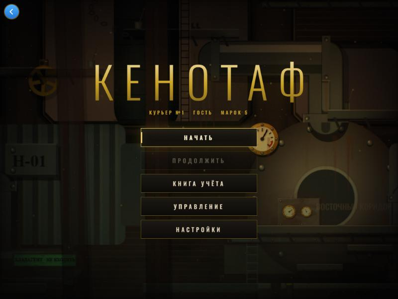
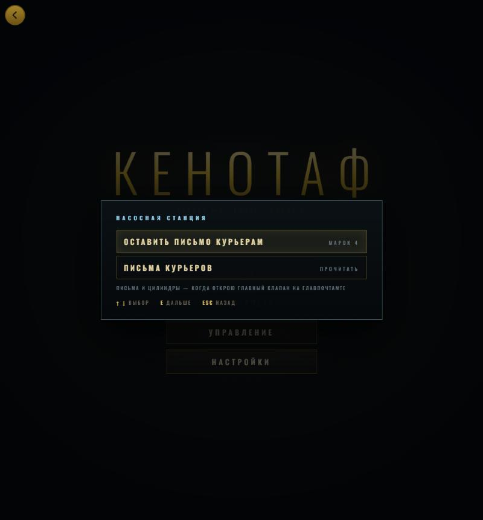
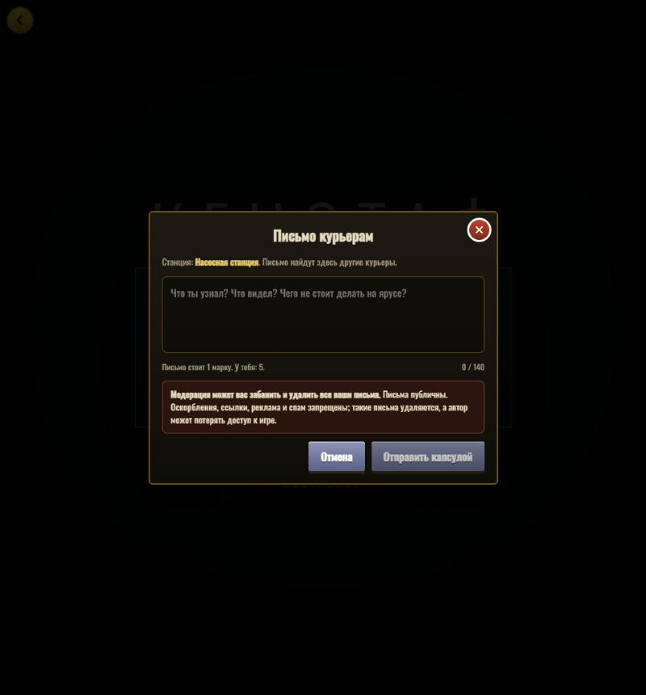
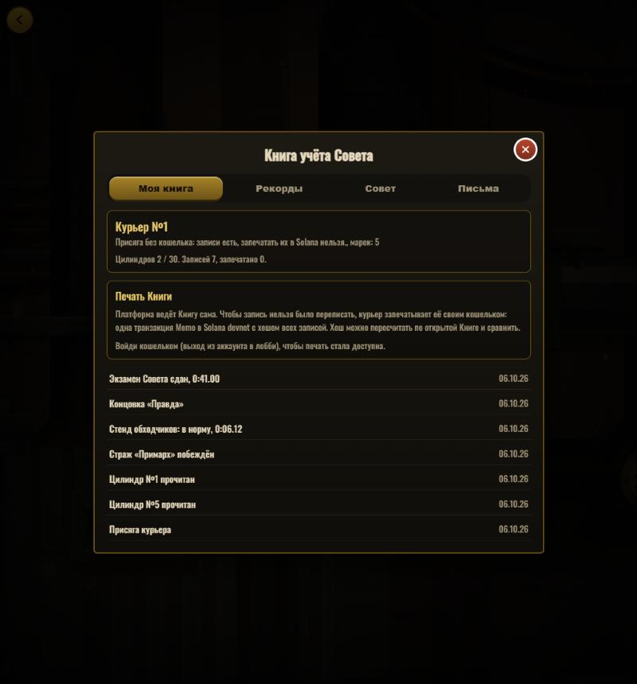

# КЕНОТАФ

**A diesel-punk metroidvania where Solana is the Council's ledger.**
You are a courier in an underground arcology whose Council forbids couriers to read the letters they carry. You read them anyway —
and now your wallet is your account, every deed goes into a Book you can seal on-chain, and couriers leave letters for each other.

Reviewing? Start with [docs/JUDGES.md](docs/JUDGES.md).



## What it is

КЕНОТАФ is a complete single-player game: five zones, 86 rooms, eight abilities, five guardians and five mini-bosses, thirty recorded
cylinders, fifteen stashes, two endings and a post-game Council exam. Combat is about *breaking* a mechanism's parts, not killing it.
The game is plain JavaScript with no build step — open `game/index.html` and it runs.

## What the hackathon added: Solana is the setting, not a menu

The Council of the arcology keeps a ledger of everything a courier does. In the game that ledger is the **Book of the Council**, and it is
bound to your wallet.

| In the game | On the platform / on Solana |
|---|---|
| Start | **Wallet sign-in** (Phantom, Solflare, Backpack, or the idosgames.com wallet): you sign the server's challenge; your address *is* your account and you become **Courier №N**. Guests can play too. |
| Read a recorded cylinder | A `read:N` entry goes into your Book; the game tells you how many couriers have read it. |
| Beat a guardian, pass a test stand, take the exam | Book entries; stands and the exam also post times to **leaderboards** (seven in all). |
| Choose an ending | "Door" or "Truth" is recorded; the *Council* tab shows how all couriers ended the game. |
| Leave a letter at a pneumatic station | Other couriers find it there. Posting costs one **stamp** (a platform currency); every foreign letter you read pays one back. Moderators can delete letters and **ban** couriers — the dialog says so. |
| Press *«Запечатать в Solana»* | One **Memo transaction on devnet**, signed by your wallet, with the SHA-256 digest of your Book keys. [`verify-seal.mjs`](idos/scripts/verify-seal.mjs) recomputes it from the public ledger. |
| Close the tab | The save lives in the cloud under your account; the newer of cloud and local wins on the next device. |

| | | |
|---|---|---|
|  |  |  |
| Station menu | Letter dialog with the moderation warning | The Book of the Council |

## How it works

```
 ┌────────── browser ──────────────────────────────────────────────┐
 │  host page (React, iDos Games SDK)          game (iframe, vanilla JS)
 │  ├ wallet sign-in                           ├ js/core/chain.js   ← the ONLY code that knows the host
 │  ├ module "kenotaf"  ◄── postMessage ─────► │ hooks: lore, guardian, stand, exam, ending, mail station
 │  │   bridge → Book, leaderboards, letters   └ works alone (file://): every Chain call is a no-op
 │  └ Book / letter dialogs, seal (Memo tx)
 └──────────────┬──────────────────────────────────┬───────────────┘
                │ platform API                     │ Solana devnet RPC
        iDos Games Title XV979CYC          Memo program (wallet-signed)
        data collections · leaderboards
        currency · custom data · bans
```

The platform side is **configuration, not code** — `idos/scripts/gen-config.mjs` generates it:

- currency `Stamps` (start with 5);
- collections `ledger` (one record per deed, counters per key), `letters` (140 chars, costs a stamp, word filter, owner/moderator delete)
  and `reads` (one per courier per letter, pays a stamp, counter per letter);
- seven leaderboards (five test stands, the Council exam, cylinders read);
- Private custom-data key for the cloud save, Public key for the courier number;
- ban levels (`council` blocks login), the `moderator` role, the Solana devnet network.

Two namespaces exist: `kz_` (players) and `dev_` (tests; owners may delete, so test scripts clean up after themselves).

## Run it

```bash
# the game alone — no build, no server
open game/index.html

# the whole thing (host + game) against the test namespace
cd idos
npm install
echo VITE_KZ_NS=dev_ > .env.local
npm run dev                       # http://localhost:5180
npm run typecheck
```

Tests (real backend, throwaway wallets, they clean up after themselves):

```bash
cd idos
node scripts/test-wallet-login.mjs     # Solana sign-in, no browser
node scripts/test-backend.mjs          # Book, letters, stamps, blocked words, leaderboards, cloud save  → ALL OK
node scripts/test-seal.ts              # Memo seal on devnet; needs ~0.1 devnet SOL on a fresh key
node scripts/verify-seal.mjs 1         # recompute courier №1's digest (NS=dev_ for the test namespace)
```


## Repository layout

```
game/                  the game (vanilla JS, 1.8 MB) — see "КЕНОТАФ (игра)" below
  js/core/chain.js     the bridge to the host (postMessage; no-ops when not embedded)
idos/                  the iDos Games host
  src/modules/kenotaf/ module.tsx (mounts the game), bridge.ts, backend.ts, chainlib.ts (Memo seal), wallet.ts, ui/
  src/walletLogin.tsx  Solana sign-in
  scripts/             gen-config, smoke tests, verify-seal, zip packer
docs/                  JUDGES.md, game design docs, screenshots
tools/                 the game's automated checks and screenshot labs
screenshots/           art
```

## Timeline and what is new

The single-player game was built before the hackathon: its history is the commits of 1–5 October 2026 in the original development
repository, imported here as the first commit. Everything for the hackathon is in `idos/`, `game/js/core/chain.js`, a handful of one-line
hooks in `game/js/` (`systems.js`, `world.js`, `trials.js`, `exam.js`, `game.js`, `post.js`, `state.js`) and `docs/`.

## Status, honestly

Verified against the real backend: wallet sign-in on devnet (throwaway keys), Book entries and counters, letters (cost, reward, blocked words),
leaderboards, cloud save, and the in-game hooks driven in a browser; the game's own `verify` checklist passes.
**Not verified end to end:** signing the Memo transaction with a real wallet extension (the public devnet faucet was empty during development),
and sign-in through the idosgames.com frame. **Not built:** NFT badges, other couriers' ghosts at the test stands.

---

# КЕНОТАФ (игра)


Дизельпанк-метроидвания на чистом JavaScript и Canvas 2D. Курьер поднимается из Отстойника
подземной аркологии к Печати, которую двести лет никто не открывал, — и делает то, чего ему
делать не велели: читает чужие письма.

Пять зон, 86 комнат, восемь способностей, пять боссов и Экзамен Совета после финала, пять мини-боссов
с аренами, 26 видов механизмов, испытательный стенд в каждой зоне, модули ранца, тридцать цилиндров
с записями, пятнадцать заначек, две концовки.

## Запуск

Открыть `game/index.html` в браузере. Сервер и сборка не нужны, работает и по двойному клику (`file://`).

## Управление

| Клавиши | Действие |
|---|---|
| A / D | движение |
| SPACE | прыжок, удержание — выше; в воздухе — второй прыжок (выхлоп); у рифлёной стены — кошки; под латунью — магнит; посреди рывка — прыжок с разгоном рывка |
| S | присед, на бегу — подкат; в прыжке с ударом — удар вниз с отскоком |
| W | взгляд вверх; с ударом — удар вверх |
| ЛКМ · J | удар ключом — ломает узлы механизмов; удержание после взмаха — тяжёлый удар; на перегреве — РАЗРЫВ (узел ломается сразу) |
| ПКМ · K | импульс резака: без урона — толкает, отражает снаряды, в миг замаха срывает атаку; с пробойником выбивает свинец |
| SHIFT | рывок: неуязвим, сквозь механизмы, метит треснувшую деталь; в последний миг перед ударом — идеальное уклонение |
| R | гарпун к латунному рыму: тянет и бросает сквозь кольцо с сохранением скорости; с движением назад — бросок назад |
| Q (держать) | залатать куртку за РЕМОНТ (копится ударами) |
| E | двери, рычаги, сальваж, цилиндры, заначки; у фонаря — отдых и сохранение; у разобранного механизма — прислушаться; у столба стенда — старт |
| ESC | пауза: планшет-карта (TAB — весь мир), записи, ранец (модули), настройки, «Выбраться к входу» (если застряли) |
| M | звук вкл / выкл |
| Геймпад | A прыжок · X удар · B импульс · Y действие · RB рывок · RT гарпун · LB/LT (держать) залатать · START пауза |

На каждое действие — одна клавиша; только удар и импульс продублированы на мышь.

Меню и пауза работают без мыши: ↑/↓ и ENTER, ←/→ меняют значение, на геймпаде крестовина и A, назад — B.

## Настройки

Графика (КИНО · WebGL или ПРОСТАЯ · Canvas — для слабых видеокарт, после перезапуска), громкость (общая, музыка, звуки), тряска экрана (выкл / слабая / обычная — по умолчанию слабая,
1–3 пикселя), сложность (легко / нормально / сложно — крепость механизмов, длина замаха, касание,
урон по курьеру), субтитры записей, разрешение (до 1080 строк) и полный экран. Хранятся отдельно
от сохранения игры.

## Структура

```
game/                    вся игра
  index.html             разметка, порядок скриптов
  css/style.css
  js/core/               утилиты, конфиг, настройки, ввод, звук, музыка (секвенсор с лейтмотивом), физика, сохранение
  js/render/             текстуры, процедурный арт (Kit, Art, подзоны SUBART, поверхность — surface.js), реквизит,
                         следы жизни (dress.js), ориентиры зон, частицы, камера, рендер
  js/world/              комнаты по зонам (rooms/z1…z5, z*x.js — расширения, trials.js — стенды), фонари, записи, системы,
                         пневмопочта, финал и титры, сцена боссов, стенды и призраки, заначки и Курьер 38, хабы, фонограммы, Экзамен Совета
  js/combat/             бой «ломать, а не убивать»: узлы, механизм, обломки, отдача, детали-примитивы
  js/entities/           игрок, бой, снаряды и зоны боссов (bossfx.js), мехи врагов и боссов (mechs/)
  js/ui/                 HUD, реплики и голоса (voice.js), карта-планшет, меню и настройки, ранец, портреты, сцены, обучение
docs/                    дизайн-документ (DESIGN.md), GDD, анализ
screenshots/             снимки
```

Скрипты подключены классическими `<script>`, без ES-модулей: иначе игра не запустится по `file://`.
